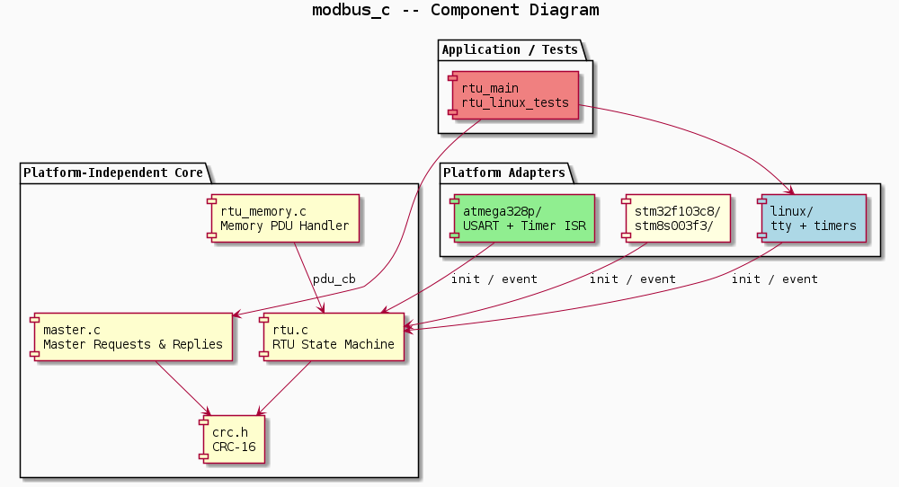
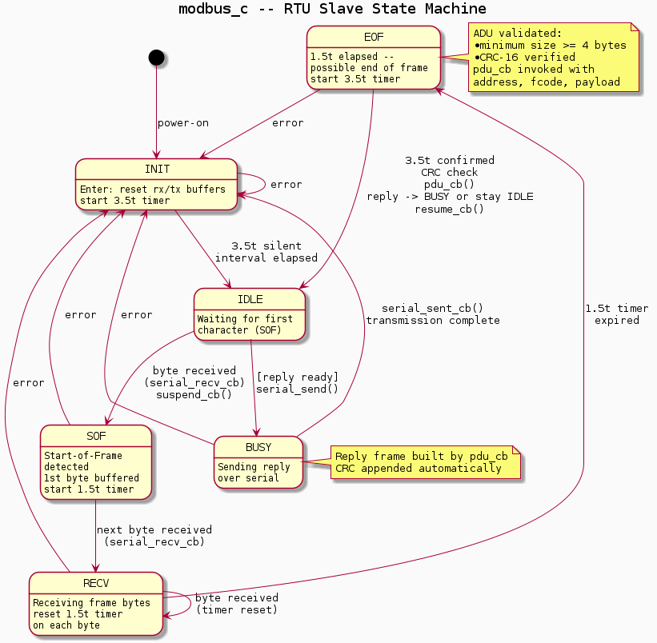
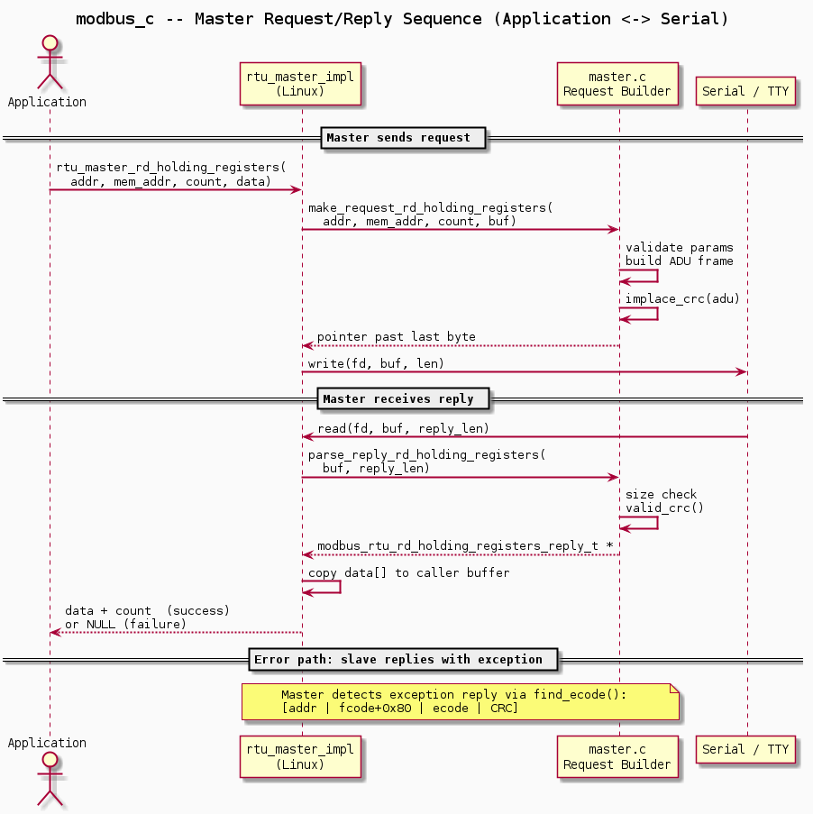
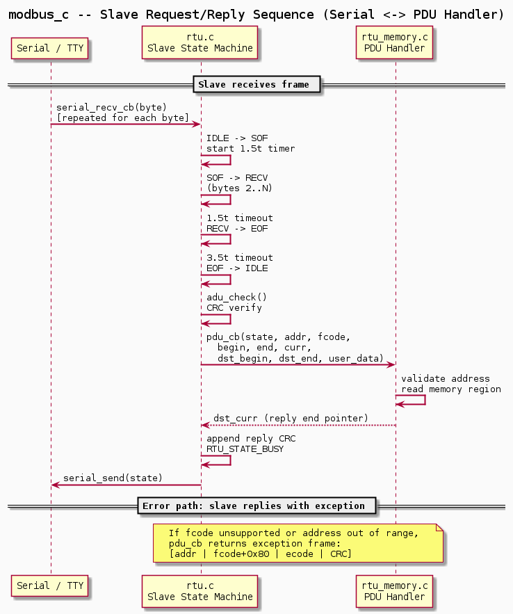

# modbus_c -- Modbus RTU Library for Microcontrollers

## Overview

A portable, callback-driven **Modbus RTU** library written in C targeting
microcontrollers and Linux. The platform-independent core -- state machine,
memory handler, master helpers, and CRC -- is shared across all targets;
platform-specific adapters supply timers and serial I/O via function-pointer
callbacks, so no platform headers leak into the core.

Key characteristics:

- **Interrupt-safe slave**: RTU framing state machine with strict t1.5 / t3.5
  timer enforcement per the Modbus serial-line specification V1.02.
- **Master support**: request builders and response parsers for the most common
  function codes; available on Linux only.
- **Memory PDU handler**: ready-made slave handler that maps Modbus registers
  and custom byte-oriented function codes (FC65 / FC66) onto a flat byte array.
- **Portable HAL**: timers and serial I/O are injected as callbacks at
  `modbus_rtu_init()` time -- the core has no platform dependencies.
- **Shared test suite**: the same tests run against a software slave, an
  HW loopback, and a real ATmega328p target.

## Components

| Component | Role |
|-----------|------|
| **rtu.c** | RTU framing state machine (INIT -> IDLE -> SOF -> RECV -> EOF -> BUSY). Validates ADU size and CRC, invokes `pdu_cb`. |
| **rtu_memory.c** | Memory-backed PDU callback. Maps FC3, FC6, FC16, FC65, FC66 onto a flat byte array with address-range checks. |
| **master.c** | Request builders (`make_request_*`) and reply parsers (`parse_reply_*`). CRC helpers `implace_crc` / `valid_crc`. |
| **crc.h** | CRC-16 engine (`crc16_update`, `modbus_rtu_calc_crc`). |
| **linux/** | Linux adapter: tty serial I/O, POSIX timer callbacks, synchronous master transactions. |
| **atmega328p/** | ATmega328p adapter: USART and timer ISR hooks. |
| **stm32f103c8/** | STM32F103C8 adapter. |
| **stm8s003f3/** | STM8S003F3 adapter. |

### Supported Targets

| Target | Role |
|--------|------|
| Linux (tty) | slave + master |
| ATmega328p | slave |
| STM32F103C8 | slave |
| STM8S003F3 | slave |

### Supported Function Codes

Each PDU is carried inside an RTU ADU:
`[ SlaveAddr(1) | FC(1) | Data0 ... Data252 | CRC16L | CRC16H ]`

Field abbreviations follow the Modbus Application Protocol Specification V1.1b3.
All multi-byte fields are big-endian (high byte first).

| FC | Name | Request PDU | Response PDU | Notes |
|----|------|-------------|--------------|-------|
| `0x01` | Read Coils | `[ 0x01, AddrH, AddrL, QtyH, QtyL ]` | `[ 0x01, ByteCnt, CoilSt[0], ..., CoilSt[N-1] ]` | Qty <= 125 coils; LSB-first |
| `0x03` | Read Holding Registers | `[ 0x03, AddrH, AddrL, QtyH, QtyL ]` | `[ 0x03, ByteCnt, RegVal[0]H, RegVal[0]L, ..., RegVal[N-1]H, RegVal[N-1]L ]` | Qty 1-125 regs; reg = 1 B, zero-extended |
| `0x05` | Write Single Coil | `[ 0x05, OutAddrH, OutAddrL, OutValH, OutValL ]` | *(echo)* | `0xFF00` ON / `0x0000` OFF |
| `0x06` | Write Single Register | `[ 0x06, RegAddrH, RegAddrL, RegValH, RegValL ]` | *(echo)* | RegValH = `0x00` (impl.) |
| `0x10` | Write Multiple Registers | `[ 0x10, AddrH, AddrL, QtyH, QtyL, ByteCnt, RegVal[0]H, RegVal[0]L, ..., RegVal[N-1]H, RegVal[N-1]L ]` | `[ 0x10, AddrH, AddrL, QtyH, QtyL ]` | Qty 1-123 regs; RegValH = `0x00` (impl.) |
| `0x41` | Read Bytes *(user-defined)* | `[ 0x41, AddrH, AddrL, ByteCnt ]` | `[ 0x41, AddrH, AddrL, ByteCnt, Data[0], ..., Data[N-1] ]` | ByteCnt 1-249 B |
| `0x42` | Write Bytes *(user-defined)* | `[ 0x42, AddrH, AddrL, ByteCnt, Data[0], ..., Data[N-1] ]` | `[ 0x42, AddrH, AddrL, ByteCnt ]` | ByteCnt 1-249 B |

## rtu_memory

`rtu_memory` is the ready-made slave PDU handler. It exposes a flat byte array
to the Modbus master through a configurable address window.

### Data Structure

```c
typedef struct {
    uint16_t addr_begin;   /* first valid Modbus address (inclusive) */
    uint16_t addr_end;     /* last  valid Modbus address (exclusive) */
} rtu_memory_header_t;

typedef struct {
    rtu_memory_header_t header;
    uint8_t bytes[];       /* flexible array -- size = addr_end - addr_begin */
} rtu_memory_t;
```

### Memory Layout

```
rtu_memory_t
+---------------------------+
|  addr_begin   (uint16_t)  | --+ header
|  addr_end     (uint16_t)  | --+
+---------------------------+
|  bytes[0]                 | <- Modbus address  addr_begin
|  bytes[1]                 | <- Modbus address  addr_begin + 1
|  bytes[2]                 | <- Modbus address  addr_begin + 2
|  ...                      |
|  bytes[N-1]               | <- Modbus address  addr_end - 1
+---------------------------+
  N = addr_end - addr_begin
```

Modbus address `addr` maps to `bytes[addr - addr_begin]`.
Accesses outside `[addr_begin, addr_end)` return an exception response.

### Register vs Byte View

The same `bytes[]` array is exposed through two different access models
depending on the function code used:

```
Modbus address:   addr_begin                              addr_end
                  |                                            |
                  v                                            v
bytes[]:   +------+------+------+------+- ... -+------+
           |  B0  |  B1  |  B2  |  B3  |       | BN-1 |
           +------+------+------+------+- ... -+------+
            [  0  ] [  1  ] [  2  ] [  3  ]       [ N-1 ]  <- byte offset

FC03 / FC06 / FC16  (16-bit register view, each byte zero-extended):
           +-------------+-------------+- ... -+-------------+
           | 0x00 |  B0  | 0x00 |  B1  |       | 0x00 | BN-1 |
           +-------------+-------------+- ... -+-------------+
               reg[0]         reg[1]                reg[N-1]
           high byte always 0x00 -- write rejects non-zero high byte

FC65 / FC66  (raw byte view, 1-to-1 mapping):
           +------+------+------+------+- ... -+------+
           |  B0  |  B1  |  B2  |  B3  |       | BN-1 |
           +------+------+------+------+- ... -+------+
```

### Component



### RTU Slave State Machine



### Master Request / Reply Sequence (Application <-> Serial)



### Slave Request / Reply Sequence (Serial <-> PDU Handler)



## Platform Adapters

### Callback ownership model

`modbus_rtu_init()` partitions the callbacks in `modbus_rtu_state_t` into two
groups.

**Platform-provided** -- the adapter passes these into `modbus_rtu_init()`;
the RTU core calls them:

| Callback | Description | ATmega328p | STM8S003F3 | STM32F103C8 |
|----------|-------------|-----------|-----------|------------|
| `timer_start_1t5` | Arm the hardware timer for a 1.5t inter-character gap; called on first byte received | [`tmr_start_1t5`](https://github.com/wdl83/modbus_c/blob/master/atmega328p/rtu_impl.c#L33) | [`tim_start_1t5`](https://github.com/wdl83/modbus_c/blob/master/stm8s003f3/rtu_impl.c#L36) | [`tim_start_1t5`](https://github.com/wdl83/modbus_c/blob/master/stm32f103c8/rtu_impl.c#L57) |
| `timer_start_3t5` | Arm the hardware timer for a 3.5t silent interval; called on INIT/restart and after 1.5t expires | [`tmr_start_3t5`](https://github.com/wdl83/modbus_c/blob/master/atmega328p/rtu_impl.c#L43) | [`tim_start_3t5`](https://github.com/wdl83/modbus_c/blob/master/stm8s003f3/rtu_impl.c#L47) | [`tim_start_3t5`](https://github.com/wdl83/modbus_c/blob/master/stm32f103c8/rtu_impl.c#L70) |
| `timer_stop` | Disable the hardware timer | [`tmr_stop`](https://github.com/wdl83/modbus_c/blob/master/atmega328p/rtu_impl.c#L53) | [`tim_stop`](https://github.com/wdl83/modbus_c/blob/master/stm8s003f3/rtu_impl.c#L58) | [`tim_stop`](https://github.com/wdl83/modbus_c/blob/master/stm32f103c8/rtu_impl.c#L83) |
| `timer_reset` | Restart the running 1.5t counter without changing prescaler; called on bytes 2...N | [`tmr_reset`](https://github.com/wdl83/modbus_c/blob/master/atmega328p/rtu_impl.c#L62) | [`tim_reset`](https://github.com/wdl83/modbus_c/blob/master/stm8s003f3/rtu_impl.c#L68) | [`tim_reset`](https://github.com/wdl83/modbus_c/blob/master/stm32f103c8/rtu_impl.c#L93) |
| `serial_send` | Transmit `txbuf[0..txbuf_curr)` asynchronously; reply PDU is ready | [`serial_send`](https://github.com/wdl83/modbus_c/blob/master/atmega328p/rtu_impl.c#L108) | [`serial_send` (1)](https://github.com/wdl83/modbus_c/blob/master/stm8s003f3/rtu_impl.c#L113) | [`serial_send` (1)](https://github.com/wdl83/modbus_c/blob/master/stm32f103c8/rtu_impl.c#L161) |

(1) STM8S003F3 and STM32F103C8 implement `serial_send` with a stale extra
`modbus_rtu_serial_sent_cb_t sent_cb` parameter (immediately discarded with
`(void)sent_cb`) -- a remnant of an earlier API revision. The current
`modbus_rtu_serial_send_t` typedef is `void (*)(modbus_rtu_state_t *)`.

**Core-owned** -- `modbus_rtu_init()` installs these internally; the platform
calls them from ISR context:

| Callback | Core installs | Effect when called | ATmega328p caller | STM8S003F3 caller | STM32F103C8 caller |
|----------|--------------|-------------------|------------------|------------------|------------------|
| `timer_cb` | `timer_silent_interval_cb` (init), switched to `timer_inter_frame_timeout_cb` on first byte | Drives t1.5/t3.5 state transitions | `tmr_cb` <- Timer0 `OCIE0A` IRQ | `tim_cb` <- TIM4 update IRQ | `isrTIM2` <- TIM2 update IRQ |
| `serial_recv_cb` | `serial_recv_cb` (rtu.c) -- appends byte to `rxbuf`, drives IDLE->SOF->RECV transitions, starts/resets t1.5 timer | Feeds each valid byte into the frame assembler | `usart_rx_recv_cb` <- USART0 `RXCIE0` IRQ | `uart_rx_recv_cb` <- UART1 RX IRQ | `rx_complete` <- `usart_rx_isr` <- `isrUSART1` |
| `serial_recv_err_cb` | `serial_recv_err_cb` (rtu.c) -- sets error flag, increments `serial_recv_err_cntr` | Aborts the current frame on line errors | `usart_rx_recv_cb` <- USART0 `RXCIE0` IRQ | `uart_rx_recv_cb` <- UART1 RX IRQ | `rx_complete` <- `usart_rx_isr` <- `isrUSART1` |
| `serial_sent_cb` | `serial_sent_cb` (rtu.c) -- resets `txbuf_curr`, transitions BUSY->INIT | Signals TX frame complete to the state machine | `usart_tx_complete_cb` <- USART0 `TXCIE0` IRQ | `uart_tx_complete_cb` <- UART1 TX IRQ | `tx_complete` <- `usart_tx_isr` <- `isrUSART1` |

The application additionally provides `pdu_cb` (invoked by the core after a
CRC-valid frame arrives in EOF->IDLE transition) and optional `suspend_cb` /
`resume_cb` (called on SOF detection and after ADU processing respectively).

---

### ATmega328p

| Resource | Peripheral | Purpose |
|----------|-----------|---------|
| Serial | USART0 | Modbus RTU byte stream (RX + TX) |
| Timer | Timer0 (8-bit, CTC) | t1.5 / t3.5 gap timing |
| Non-volatile storage | EEPROM | Slave address persistence |
| Power management | Idle sleep | CPU sleep between Modbus events |

**Clock**: 16 MHz system clock.

**USART0** is configured at 19 200 bps, 8 data bits, even parity.

- **RX** -- continuous non-buffering async mode via `usart0_async_recv_cb`.
  Each byte received fires the `RXCIE0` (RX Complete) interrupt; the driver
  calls `usart_rx_recv_cb(data, flags, user_data)`. That function checks the
  `fop_errors` field (frame error `FE0`, overrun `DOR0`, parity `UPE0`):
  - No error -> `state->serial_recv_cb(state, data)` -- the core's byte handler
    appends the byte to `rxbuf`, drives the SOF/RECV state transition, and
    starts or resets the t1.5 timer.
  - Any error -> RX data register drained, then
    `state->serial_recv_err_cb(state, data)` -- the core sets the error flag
    and increments `serial_recv_err_cntr`.
- **TX** -- asynchronous, interrupt-driven transmission via `usart0_async_send`.
  The driver uses `UDRIE0` (Data Register Empty) to clock bytes out and
  `TXCIE0` (TX Complete) to detect end of frame. On completion
  `usart_tx_complete_cb` calls `state->serial_sent_cb(state)`, which resets
  `txbuf_curr` and transitions BUSY -> INIT.

**Timer0** is used in **CTC mode** (WGM01), clocked at `f_cpu / 256 = 62 500 Hz`
(16 us per tick). The Output Compare A register (`OCR0A`) is loaded with:

| Timeout | OCR0A | Actual period |
|---------|-------|--------------|
| t1.5 | 47 | 47 * 16 us = 752 us |
| t3.5 | 110 | 110 * 16 us = 1 760 us |

The `OCIE0A` interrupt fires once on match; the ISR calls
`state->timer_cb(state)` which is the core-owned function currently installed
for the active timeout phase (t1.5 inter-character or t3.5 silent interval).
The prescaler bits in `TCCR0B` are preserved across a reset so the counter
can be restarted without re-selecting the clock source.

**EEPROM** -- the Modbus slave address is read at startup from the byte at
`EEPROM_ADDR_RTU_ADDR` (user-defined compile-time constant) using
`eeprom_read_byte`.

**Sleep** -- the main loop uses `SLEEP_MODE_IDLE` (`sleep_cpu()` guarded by
`cli` / `sei`). The CPU halts between Modbus events; any USART0 or Timer0
interrupt wakes it immediately.

---

### STM8S003F3

| Resource | Peripheral | Purpose |
|----------|-----------|---------|
| Serial | UART1 | Modbus RTU byte stream (RX + TX) |
| Timer | TIM4 (8-bit, auto-reload) | t1.5 / t3.5 gap timing |

**Clock**: 8 MHz system clock.

**UART1** is configured at 19 200 bps, 8 data bits, even parity.

- **RX** -- continuous non-buffering async mode via `uart1_async_recv_cb`.
  Each byte received fires the UART1 RX interrupt; the driver calls
  `uart_rx_recv_cb(data, flags, user_data)`. That function checks
  `flags->errors.fopn` (frame / overrun / parity / noise):
  - No error -> `state->serial_recv_cb(state, data)` -- the core's byte handler
    appends the byte to `rxbuf`, drives the SOF/RECV state transition, and
    starts or resets the t1.5 timer.
  - Any error -> RX register drained, then
    `state->serial_recv_err_cb(state, data)` -- the core sets the error flag
    and increments `serial_recv_err_cntr`.
- **TX** -- asynchronous interrupt-driven transmit via `uart1_async_send`.
  On completion `uart_tx_complete_cb` calls `state->serial_sent_cb(state)`,
  which resets `txbuf_curr` and transitions BUSY -> INIT.

**TIM4** is an 8-bit auto-reload timer (dedicated basic timer on STM8S).
Auto-reload preload is enabled; the clock is divided by 128, giving:

`8 MHz / 128 = 62 500 Hz` -> 16 us per tick -- identical tick period to the
ATmega328p adapter, so the same compare values apply:

| Timeout | TOP | Actual period |
|---------|-----|--------------|
| t1.5 | 47 | 47 * 16 us = 752 us |
| t3.5 | 110 | 110 * 16 us = 1 760 us |

The TIM4 update interrupt fires on counter match; the ISR clears the flag
with `TIM4_INT_CLEAR()`, then calls `state->timer_cb(state)`. On a timer
reset the peripheral is briefly disabled, the counter zeroed, and the flag
cleared before re-enabling, preventing a spurious interrupt.

---

### STM32F103C8

| Resource | Peripheral | Purpose |
|----------|-----------|---------|
| Serial | USART1 (APB2) | Modbus RTU byte stream (RX + TX) |
| Timer | TIM2 (APB1, 32-bit) | t1.5 / t3.5 gap timing |
| GPIO | GPIOA PA9 / PA10 | USART1 TX / RX pins |
| Clock control | RCC | Enables GPIOA and USART1 clocks |
| Interrupt controller | NVIC | Routes TIM2 and USART1 interrupts |

**Clocks**: APB2 at 72 MHz (USART1 source), APB1 at 36 MHz (TIM2 source).

**GPIO** -- configured at startup inside `usart_init`:
- **PA9** -- USART1 TX: alternate-function push-pull output, 50 MHz slew rate.
- **PA10** -- USART1 RX: floating input with pull-up enabled.

**USART1** is configured at 19 200 bps, 8 data bits, even parity.

- **RX** -- one-byte-at-a-time async mode using a static 1-byte buffer
  `rxbuf_[1]`. At startup `usart_async_recv(USART1_BASE, &rx_ctrl_)` submits
  the first receive. `isrUSART1` fires on every USART event; when
  `USART_RX_INT_ENABLED && USART_RX_READY` it calls
  `usart_rx_isr(USART1_BASE, &rx_ctrl_)` which reads the DR into `rxbuf_[0]`
  and invokes the `rx_complete` completion callback. `rx_complete` checks
  `ctrl->flags.errors.fopn`:
  - No error -> `state->serial_recv_cb(state, rxbuf_[0])` -- the core's byte
    handler appends the byte to `rxbuf`, drives the SOF/RECV state transition,
    and starts or resets the t1.5 timer.
  - Any error -> DR drained, then `state->serial_recv_err_cb(state, rxbuf_[0])`
    -- the core sets the error flag and increments `serial_recv_err_cntr`.

  After each byte the buffer pointers and flags in `rx_ctrl_` are reset and
  `usart_async_recv` is resubmitted, keeping the pipeline primed.
- **TX** -- `tx_ctrl_` is populated with `state->txbuf` / `state->txbuf_curr`
  pointers and `tx_complete` as the completion callback, then passed to
  `usart_async_send`. `isrUSART1` handles both `USART_TX_READY` (DR empty)
  and `USART_TX_COMPLETE` conditions via `usart_tx_isr`. On frame completion
  `tx_complete` calls `state->serial_sent_cb(state)`, which resets
  `txbuf_curr` and transitions BUSY -> INIT.

**TIM2** is a 32-bit general-purpose timer clocked from APB1 (36 MHz).
The prescaler is set to 359 (/ 360), giving a 100 kHz tick (10 us per count).
Auto-reload preload is enabled:

| Timeout | ARR | Actual period |
|---------|-----|--------------|
| t1.5 | 75 | 75 * 10 us = 750 us |
| t3.5 | 175 | 175 * 10 us = 1 750 us |

`isrTIM2` clears the update-interrupt flag first, then guards against spurious
interrupts by checking `TIM_ENABLED` (spurious events are counted in
`tim2spurious_`). It then calls `state_->timer_cb(state_)`. The static pointer
`state_` is set in `tim_start_*` and cleared to `NULL` in `tim_stop`,
providing ISR context without a dedicated ISR argument.

---

## Building

Start by cloning the repository with all submodules:

```console
git clone --recurse-submodules https://github.com/wdl83/modbus_c
cd modbus_c
```

### Linux slave binary

```console
make -f rtu_linux.mk
```

### ATmega328p slave binary

```console
make -f rtu_atmega328p.mk
```

## Testing

Build the test binary:

```console
make -f rtu_linux_tests.mk
```

Run with the default software slave (Linux RTU in a separate thread):

```console
make -f rtu_linux_tests.mk run
```

The same test suite supports three targets:

1. **Software RTU** -- Linux slave running in a separate thread (default):
   ```console
   ./obj/rtu_linux_tests
   ```
2. **HW loopback** -- two USB-to-serial converters with crossed RX/TX pins:
   ```console
   ./obj/rtu_linux -d /dev/ttyUSB1 -a 32 -t 10000 -T 20000 -D 1024 -p E
   ./obj/rtu_linux_tests -d /dev/ttyUSB0 -a 32 -t 10000 -T 20000 -p E
   ```
3. **HW target** -- ATmega328p flashed with `rtu_atmega328p.hex`:
   ```console
   ./obj/rtu_linux_tests -d /dev/ttyUSB0 -a 15 -p E
   ```

## Coverage Report

[report](https://wdl83.github.io/modbus_c)
